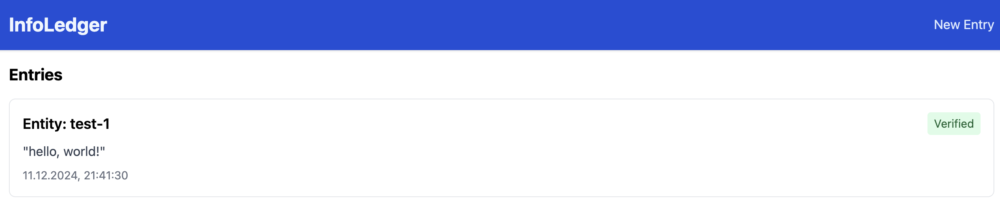

# InfoLedger

A ledger system that anchors data entries to public blockchains for tamper-evident timestamping and verification. Built with Bun, TypeScript, and React, it provides a simple way to create immutable records with cryptographic proofs.

This system is particularly useful for scenarios requiring trusted record-keeping and audit trails, such as supply chain tracking, document notarization, or compliance logging. While the system itself is not decentralized, it leverages public blockchains as neutral sources of truth.

The current implementation uses Bitcoin for anchoring, but the architecture supports integration with any blockchain or timestamping service, allowing organizations to maintain verifiable records while choosing their preferred anchoring mechanism.

## How It Works

The system maintains a hash-linked ledger where:
1. Each entry contains its data and a hash of the previous entry
2. Entry hashes are anchored to the blockchain
3. Entries are considered verified once their transaction has sufficient confirmations (50 blocks)

This provides:
- Cryptographic proof that data existed at a specific time
- A tamper-evident chain of entries
- Independent verification through public blockchains (just Bitcoin for now)

Note: While entries are linked through hashes, the system primarily relies on Bitcoin anchoring for verification. The hash chain provides structure but is not the primary security mechanism.

## Setup

### Prerequisites
- [Bun](https://bun.sh/) (v1.0 or later)
- [Docker](https://www.docker.com/) and Docker Compose
- Node.js 18+ (for frontend development)

### Backend Setup

1. Install dependencies:
   ```bash
   cd backend
   bun install
   ```

2. Start the Bitcoin regtest node:
   ```bash
   docker-compose up -d bitcoin
   ```

3. Create the wallet and generate initial blocks:
   ```bash
   bun run scripts/setup-bitcoin-regtest.ts
   ```

4. Start the backend server:
   ```bash
   bun run src/server.ts
   ```

The backend will start on http://localhost:4891

### Frontend Setup

1. Install dependencies:
   ```bash
   cd frontend
   bun install
   ```

2. Start the development server:
   ```bash
   bun dev
   ```

The frontend will be available at http://localhost:3000

## Usage

The application allows you to create and verify timestamped entries on the Bitcoin blockchain. Here's how it works:

1. Create a new entry by filling out the form. Each entry requires an Entity ID and some data.
   Entries with the same Entity ID are grouped together, representing different versions of the same entity.

   

2. When first created, the entry will be marked as "unverified". This is because it needs sufficient blockchain confirmations to be considered verified.

   

3. A background verification task runs every 6 seconds to check if entries have received enough confirmations.
   Currently, the entry is considered confirmed when its transaction has 50 blocks on top of it.

4. To make the entry verified, generate 50 new blocks:
   ```bash
   bun run scripts/generate-blocks.ts 50
   ```

5. Refresh the page - your entry should now show as verified with a Bitcoin timestamp proof.

   

Each entry is immutably linked to its previous version through a hash chain, and every hash is anchored to the Bitcoin blockchain for tamper-evident timestamping.

